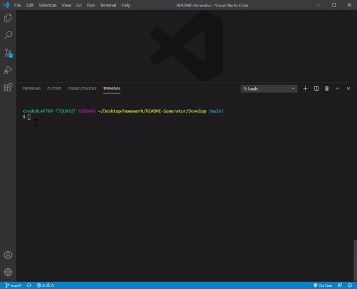

## README Generator

The README generator is designed to ask the user a number of questions and based on those answers, generate a professional README.md file. This generator operates in NodeJS.

## Challenges

This was my first project using NodeJS. I found it more difficult than what I am used to compared to working in the Chrome browser. The idea of building custom packages was strange at first but I can understand how this can lighten up our applications in the future as they get larger.

## Project Links

https://github.com/chadclark1234/README-Generator

